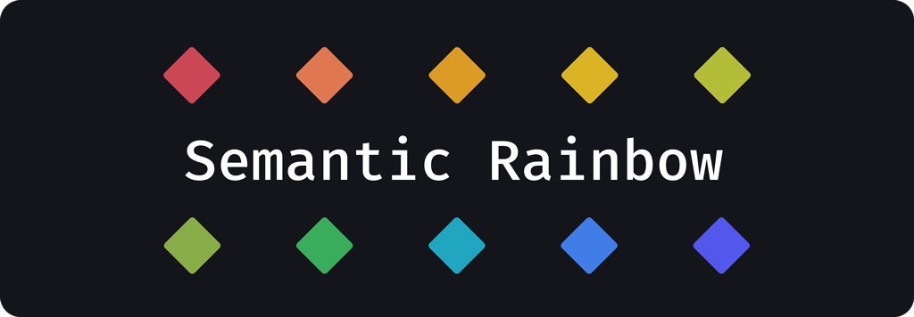
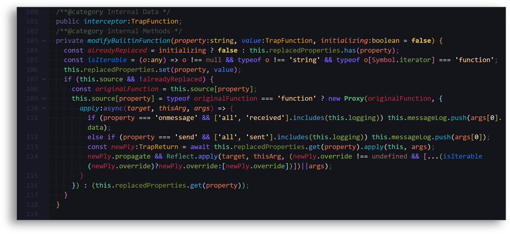
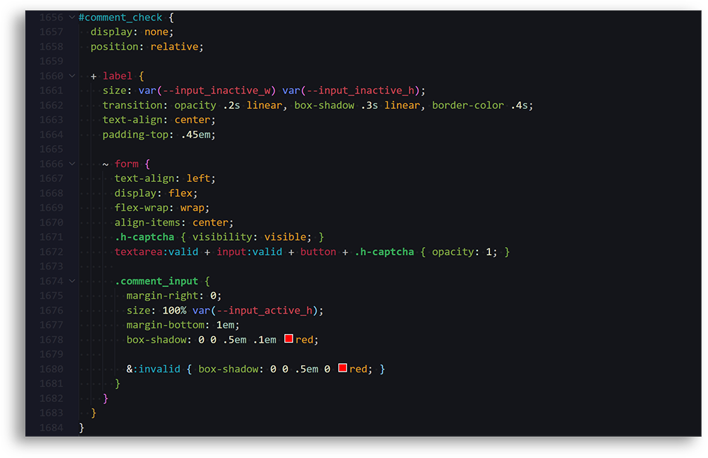
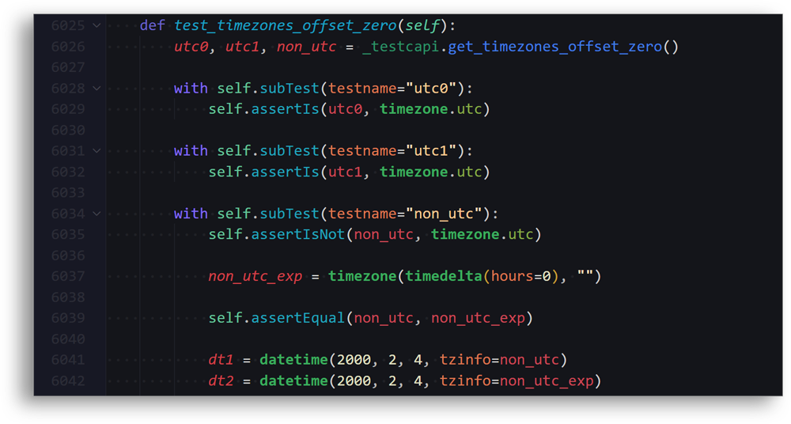
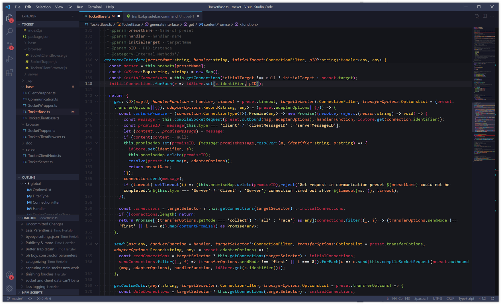

## Overview
Plenty of themes offer minimalist highlighting focusing on specific aspects of code using a limited color palette. This theme takes the opposite approach.  
Utilizing both bold colors and subtle distinctions, anything than *can* be identified *will* be identified.  

### **TypeScript**

### **SCSS**

### **Python**

### **Full Editor**

List of languages supported (sorted by amount of tests):
- TypeScript/JavaScript
- CSS/SCSS
- Python
- lua
- HTML/Twig
- Go
- Ruby
- C++

Semantic Highlighting enables an amazing amount of granular control of styles and **Semantic Rainbow** aims to make use of all of it.

By highlighting **14** types of semantic tokens each with **7** varations corresponding to different semantic modifiers and an additional **18** shades for combinations of two or more individual modifiers, this theme defines a total of **350** styles for all conceivable (and a few inconceivable) kinds of tokens.

If you've ever wanted a visual distinction between a *readonly async method*, and a *readonly async method of a default library* and also want to tell it apart from a *non-async default library method* look no further.

For a list of styles and a breakdown of the design process, check out the [GitHub page of this repo](https://thertzlor.github.io/semantic-rainbow/).

## How it works
If 350 styles sounds like too much to configure by hand, you're right.  
*Semantic Rainbow* is programmatically generated, based on a configuration of base colors for the different tokens and a list of specific color transformations for token modifiers which can also be stacked to represent different combinations.  
About 8.29% of styles/transformations are manually defined, stepping in where the automatic generation produced less than optimal results.

The definition of colors and transformations follows a [simple spec](https://github.com/Thertzlor/semantic-rainbow/tree/main/generator#user-content-working-with-the-semantic-theme-generator) for easy tweaking and forking to create any number of dynamic semantic themes.

## Compatibility
This theme relies on the presence of language server that support Semantic Highlighting. Some of the languages with the best support for this feature include JavaScript, TypeScript and Python.  
Keep in mind results might vary based on the language extensions you have installed, and even for non-semantic highlighting the theme attempts to approximate results by providing fallback mappings to TextMate rules including but not limited to the [VSCode semantic token scope map](https://code.visualstudio.com/api/language-extensions/semantic-highlight-guide#semantic-token-scope-map).

## Installation
Install from VSCode or via the [Visual Studio Code Marketplace](https://marketplace.visualstudio.com/items?itemName=thertzlor.semantic-rainbow).

## Roadmap
* Support for even more TinyColor color transformations
* Including color readability checks
* Language specific rules

## Contributing
I am always looking for ways to improve Semantic Rainbow.

* Know any language with Semantic Highlighting that this theme could support better?
* Notice any contexts in which the existing syntax highlighting looks bad or incomplete?
* Are there any TextMate fallbacks or modifier combinations that should be included?

Preferably issues or fixes should be demonstrated in an example file and with info about, if applicable, extensions used to provide syntax highlighting.

## Credits
* [**Horizon Dark Theme**](https://horizontheme.netlify.app/) - Semantic Rainbow started as an extension of this theme and it remains an influence especially in the non-syntax parts. 
* [**TinyColor**](https://github.com/bgrins/TinyColor) -  Used for color transformations.
